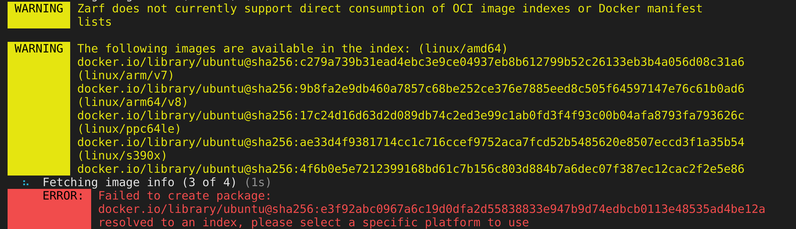

# Crane in Zarf

Crane is an incredibly important library to Zarf as it's relied upon for our most crucial functionality, pull OCI images into packages & the cache and push OCI images to the Zarf registry. [OCI](https://opencontainers.org/) images are bundles of files that conform to the [OCI image format spec](https://github.com/opencontainers/image-spec). The most common used OCI images are container images, but Helm charts, cosign signatures, crossplane objects, and Zarf packages all implement the OCI spec. Checkout [Understanding OCI and unpacking Zarf](https://defenseunicorns.blogin.co/posts/understanding-oci-and-unpacking-oci-in-zarf-251656) to learn more about how Zarf packages become OCI artifacts. Over the past year the Zarf team has found several bugs with Crane, relating to OCI that have made us question if we should look at alternatives. Below is a summary of some of the issues we've found as I believe they're both interesting & useful for understanding OCI. 

## Zarf local docker fallback breaking on with Docker in containerd Mode

Zarf has the ability to fallback and grab images stored in the docker daemon. You can actually force this behavior with a clever hack created by @RothAndrew, to build your package without internet
```bash
docker network rm no-internet-net || true
docker network create --internal no-internet-net
docker run --platform linux/amd64 --rm -v $(pwd):/work -v /var/run/docker.sock:/var/run/docker.sock -w /work/zarf --network no-internet-net ghcr.io/defenseunicorns/build-harness/build-harness:2.0.24 zarf package create --architecture $(scripts/get_arch.sh) --confirm --skip-sbom --no-progress
docker network rm no-internet-net
```
Zarf pulls images from the local docker daemon using crane. Crane assumes images pulled from docker client have an image id equaling the [config](https://github.com/opencontainers/image-spec/blob/main/config.md) sha. While the concept of image IDs aren't official in the OCI spec it isn't intuitive to have a config file as the sha since the sha of the image manifest better encapsulate everything contained in an image. It's possible to have two different images with the same config file, but images with same manifest file are always exactly the same. Still, Docker image ids were created before the OCI spec, and it'd be pretty rare to find two different images with the same config. The image ids are a user facing field so even if there are duplicates it's not a big deal, however, the store engine for docker can be switched out to the [containerd image store]() which instead uses the image manifest sha's as the image id. Because crane receives an image manifest sha when it expects an image config file it names the config file incorrectly in the oci cache. Every file in an OCI cache is named it's sha, it is an amazing feature for de-duplication since no matter how many images registries have when images share layers registries never have to store that file twice. They can simply point to the file with same sha. It also lets downstream tools (like Zarf & Crane) verify that the file name matches the sha of the contents. In the case of config files from the containerd image store the file was being named with the image id (manifest sha) while the contents of the file were the image config file. Since we do not trust that crane will fix the issue we created a simple, but ugly, fix on the Zarf side. We simply rename files to match the contents of their sha's on create. We also removed any references to the crane `img.ConfigName()` function, and instead use the config file sha specified within the image manifest. Image manifests always point to a config file by sha, remember it's a (merkle trees)[https://en.wikipedia.org/wiki/Merkle_tree], so this is a reliable source. 

```go
blobDir := filepath.Join(cfg.DestinationDirectory, "blobs", "sha256")
	err = filepath.Walk(blobDir, func(path string, fi os.FileInfo, err error) error {
		if err != nil {
			return err
		}

		if fi.IsDir() {
			return nil
		}

		hash, err := helpers.GetSHA256OfFile(path)
		if err != nil {
			return err
		}
		newFile := filepath.Join(blobDir, hash)
		return os.Rename(path, newFile)
	})
	if err != nil {
		return nil, err
	}
```

https://github.com/defenseunicorns/zarf/issues/2584

## Concurrent writes

Zarf pulls images in Parallel, this can speed up the process of downloading images quite a bit, especially since many users have large images and lots of them. Crane however does not expose a method of downloading images that is thread safe. The reason has to do with file writes. As I mentioned earlier, registries don't have to store duplicate layers of the same image in their filesystems. Zarf packages and the Zarf cache, which is just a crane cache, have many of the same properties as Registry file systems. When Crane writes a layer to a package or cache it first checks if the layer already exists in the filesystem. If not it starts writing a layer. Now imagine two images are being written at the same time and they share a layer. Both may see that the layer does not already exist and start writing resulting in an error that looks like this
```base
/user/.zarf-cache/images/sha256-e769c9462d1bfeb130b57c84903eab0c2d8a25298bac4543f04b78adad5414ae:
          The process cannot access the file because it is being used by another process
```

Zarf's solution to this problem while retaining parallel pulls was to simply catch when we get errors and remove the in progress half written layers & try to run the pull again. If there is another failure, we simply pull everything sequentially. It takes longer but eliminates the chance of that error occurring.

https://github.com/defenseunicorns/zarf/issues/2408

I did not solve this issue but shout out to Razzle who completely refactored our image pull process to resolve this.

## caching Cosign images
Cosign knows that each one of it's layers is going to be very slim. Cosign choose to not compress it's layers since they will always be small plain text files. Usually, when an OCI image layer is compressed it tends to be larger files like a tarball of a container image filesystem, however this will never happen with cosign. Check out a (cosign OCI image)[https://oci.dag.dev/?image=ghcr.io%2Fstefanprodan%2Fpodinfo%3Asha256-57a654ace69ec02ba8973093b6a786faa15640575fbf0dbb603db55aca2ccec8.sig] to get an idea of the structure. When Crane pulls cosign image layers from the cache it assumes that some of them should be compressed, and compresses them before writing to package. This results in a compressed file which, in reality, should be plain text, of course the contents are different and the write fails since the sha doesn't match the contents.

The solution in Zarf for this in Zarf is to simply only cache OCI images if they are container images, non container images generally end up being pretty small anyway so we doubt anyone will notice or request caching. 

## caching Helm images
Helm has a similar, but separate, issue with the crane cache. When crane caches a helm OCI image it walks through the layers of the image. When examining the compressed layer of the helm chart Crane tries to get the diff Ids of the layer and fails. [Diff Ids](https://github.com/opencontainers/image-spec/blob/main/config.md) Diff Ids are only relevant to layers with the media type "application/vnd.oci.image.config.v1+json". Helm always has just one layer of compressed images, I have not looked into the code extensively to see how Crane determines which layers to check for Diff Ids for so this is speculation, but Crane might simply do this for any layer that is a tarball. With container images this would not be a problem, however it is for Helm OCI images as they don't have an image config to specify Diff Ids, and they always have exactly one compressed layer so there would be no reason to implement diff ids. The one compressed layer is simply the text files that comprise the helm chart. Since the text files in Helm are small, the above solution of only caching images if they are container images works well. 

# Reflection
Crane has been super useful for Zarf, but given the above problems and the lack of responses for bugs on the [crane github issues](https://github.com/google/go-containerregistry/issues) the team feels it's worth considering alternatives. The first option evaluated will be ORAS, a much newer project, built to be library first & to work with non container images. This differs from crane which was built with a focus on container images. Non-container images are functional, but have bugs as we've detailed above. ORAS does a better job respecting context as well which gives callers more control over timeouts and cancellations of pulls. 

Of course it is possible that Crane's wealth of features trumps the cleaner implementation by ORAS. As far as I know, ORAS doesn't have a builtin way to create a cache or pull images from the daemon.


# Bonus Non Crane OCI issue

## Image index sha's cannot be pulled by Zarf
This OCI issue doesn't have to do with Crane, but instead stems from using OCI in the air-gap. Zarf preforms lots of magic image manipulation, usually this works great, however OCI images tagged with a sha pointing to an (image index)[https://github.com/opencontainers/image-spec/blob/main/image-index.md] is a notable exception that cannot be pulled by Zarf. An Image index points to specific (image manifests)[https://github.com/opencontainers/image-spec/blob/main/image-index.md] which then points to layers which make up the images. You can think of the image manifests as the objects representing the actual image for a specific platform (os & architecture), while image indexes represent the image on any available platform. Let's look at an example
```json
{
  "schemaVersion": 2,
  "mediaType": "application/vnd.oci.image.index.v1+json",
  "manifests": [
    {
      "mediaType": "application/vnd.oci.image.manifest.v1+json",
      "digest": "sha256:b3fabdc7d4ecd0f396016ef78da19002c39e3ace352ea0ae4baa2ce9d5958376",
      "size": 673,
      "platform": {
        "architecture": "arm64",
        "os": "linux"
      }
    },
    {
      "mediaType": "application/vnd.oci.image.manifest.v1+json",
      "digest": "sha256:454bf871b5d826b6a31ab14c983583ae9d9e30c2036606b500368c5b552d8fdf",
      "size": 673,
      "platform": {
        "architecture": "amd64",
        "os": "linux"
      }
    }
  ]
}
```
The above index.json references two manifests. They are the amd64 and arm64 images respectively. While not yet common, tagging an image using an index sha is, in my opinion, best practice, so long as you don't care about the airgap. The major advantage is that images can be given immutable tags while not being platform specific. A public helm chart can tag it's image with an immutable sha, while not limiting it's helm chart to a certain platform or architecture. Tools in the ecosystem like docker, ORAS, and crane will traverse the index.json to find the desired image for the users platform. Indexes are immutable to changes because they contain digests of manifests which contain digests of container filesystems. If any link in the chain changes the digest of all the parents will change. Structures like this are known as (merkle trees)[https://en.wikipedia.org/wiki/Merkle_tree]. 

This is problematic in the air-gap as an image index requires that all manifests be present in the registry. If Zarf wanted to bring an image index into the air-gap we would have to bring every single manifest referenced. Many popular images, such as nginx, often publish indexes with around fifteen different platforms. Bringing in fifteen different images when you expected only one could easily bloat a package and frustrate users. Instead zarf gives users an error message and the choice to grab an index
 

One day in the future we may choose to support pulling image indexes into Zarf, they would provide an easy way to create multi architecture packages. However, the demand for multi architecture packages is not great enough, yet, to justify adding them. Additionally the potential for misuse of this feature would be large, not many users understand OCI under the hood, which is generally good; it was created to be simple to use. 